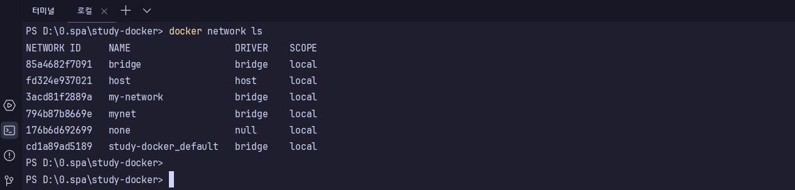
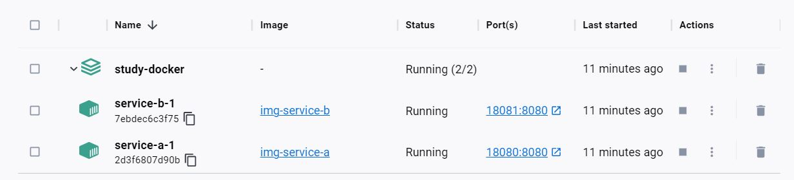

# study-docker

## 실습
- 2개의 스프링 컨테이너를 생성하고 사용자가 service-a 컨테이너의 컨트롤러를 호출하면 service-b 컨테이너를 호출하도록 구성

## Doker 사용

도커 네트워크 생성
```Shell
docker network create [네트워크이름]
```
프로젝트 빌드
```Shell
./gradlew clean bootJar  
```
이미지 생성
```Shell
docker build -t [이미지이름] [도커파일위치]
```
이미지 확인
```Shell
docker images
```


컨테이너 생성 및 실행
```Shell
docker run -d --name [컨테이너이름] 
    --network [네트워크이름] 
    -p [호스트포트]:[매핑할포트] 
    [이미지이름]
```
컨테이너 확인
```Shell
docker ps
```


결과 확인


## Doker Compose 사용

docker-compose.yml 파일 생성

실행 및 확인
```Shell
docker compose up -d
```


네트워크가 파일 경로를 기준으로 자동으로 생성된 것을 확인



Docker Desktop 확인

